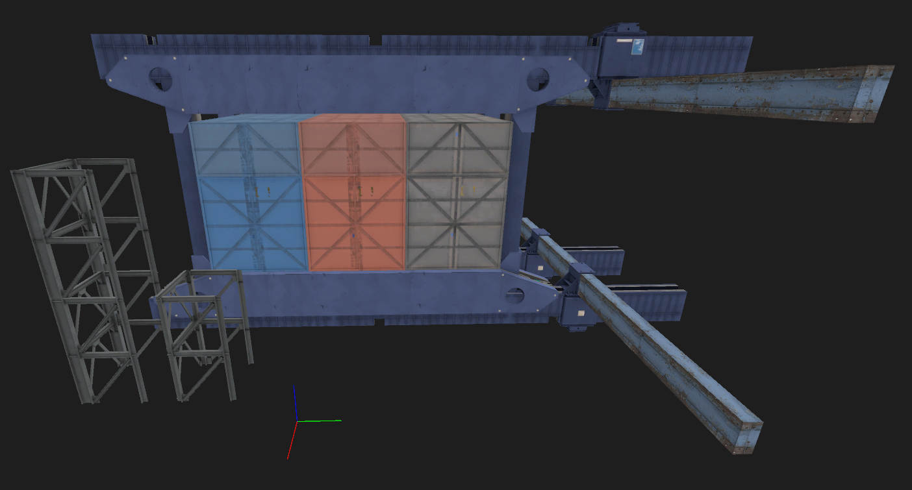

# AnDashik's Pack of Random Instances
Pack of my modifies version of Portal 2 assets. Maybe I'll add something trully new in future, idk :P

Installation:
- Create new folder in `Portal 2`, for example `andashik_assets` or whatever you want to call it;
- Place folder `models` and `materials` inside `andashik_assets` (or another desired folder, for example `dlc_4`);
- Find `gameinfo.txt` inside `Portal 2\portal2` and add `Game	andashik_assets` in searchpaths. Note: from waht I know, if you're using `dlc_4` folder you don't need to do this step, game will automatically mount `dlc_*` folders untill they don't miss any number.

Includes:
- Textures
- - Modified `backpanel` textures (added SSBump's and new variant for white backpanels);
- - Modified with SSBump's  `concrete_bts_floor002b`, `concrete_bts_floor002b_bottom`, `concrete_bts_floor002b_top`, `concrete_bts_floor002d`, `concrete_pillar_01`, `concrete_pillar_03`. I'm not sure if this does work, but okay...
- - Blue variant of `underground_metalgrate001b`;
- - A few colored versions of `plasticwall002a`, `plasticwall002b` and lighter version of `plasticwall003a`;
- - Blue variant `1970_tile_floor_01`, `1970_tile_floor_01b` and `office_tilefloor003a`;
- - Random shitty signages related to GLaDOS;
- - 3 modified version of `underground_nextchamber` signage (overlay).
- Models
- - Blue `roommover` props (this thing we can see in BTS area around chambers);
- - Gray and red variants of underground `gantry_256_*`.

Credit: not required (though it'll be cool if you do credit me).
Feel free to use and modfiy as you wish!

## Image:

